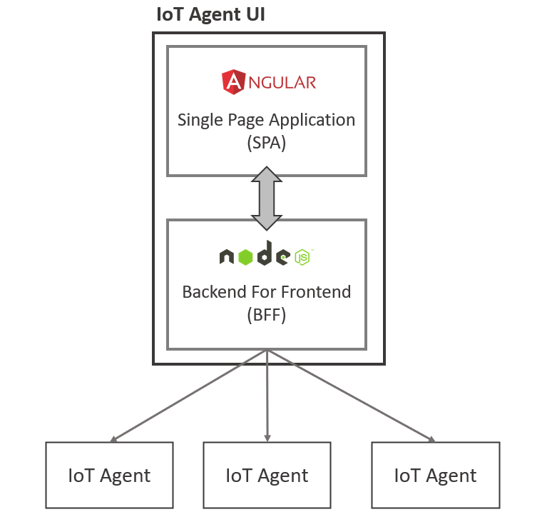

# IoT Agent UI: the FIWARE IoT Agent Web UI for IoT Agents

 

  

An Internet of Things Agent that communicates and monitors any IoT Agent built on top of [IoT Agent Node.js Library](https://github.com/telefonicaid/iotagent-node-lib).

Further general
information about the FIWARE IoT Agents framework, its architecture and the common interaction model can be found in the
library's GitHub repository.

This project is part of [FIWARE](https://www.fiware.org/). For more information check the
[FIWARE Catalogue entry for the IoT Agents](https://github.com/Fiware/catalogue/tree/main/iot-agents).

| :books: [Documentation](https://iotagent-opcua.rtfd.io) |  [quay.io](https://quay.io/repository/fiware/iotagent-opcua) | :mortar_board: [Academy](https://fiware-academy.readthedocs.io/en/latest/iot-agents/idas) | :dart: [Roadmap](https://github.com/Engineering-Research-and-Development/iotagent-opcua/blob/main/roadmap.md) |
| ------------------------------------------------------- | --------------------------------------------------------------------------------------------------------------------------------------- | ----------------------------------------------------------------------------------------- | --------------------------------------------------------------------------------------------------------------- |

## Contents

-   [Background](#background)
-   [Install](#getting-started---install)
    -   [Docker install](#docker---recommended)
    -   [NPM Install](#npm)
-   [Usage](#usage)
-   [API](#api)
-   [License](#license)

## Background

### Positioning in the overall F4I Reference Architecture

The growind need of managing serveral IoT Agents installed at industrial plants led to the development of this asset which is a Web User Interface to monitor and control with ease what's happening under the hood. IoT Agent UI is fully compliant with FIWARE iotagent-node-lib thus every agent built on top of this library is supported out-of-the-box. 

## Getting Started - Install

Currently two options are available to install the IoT Agent UI:

### Docker - Recommended

We suggest using a **Docker-first** approach in order to avoid issues related to your environment configuration.
Moreover, using this approach you will be provided with all the needed components: Mongo instance

A step-by-step tutorial is available
[here](https://github.com/Engineering-Research-and-Development/iotagent-ui/blob/main/docs/iot_agent_ui_tutorial.md)

### npm

Follow the two READMEs in the proper project sub-folders:
[iotagent-ui-spa](https://github.com/Engineering-Research-and-Development/iotagent-ui/blob/main/iotagent-ui-spa/README.md) 
[iotagent-ui-bff](https://github.com/Engineering-Research-and-Development/iotagent-ui/blob/main/iotagent-ui-bff/README.md) 

## Usage

  

## API

Apiary reference for the Configuration API can be found
[here](http://docs.telefonicaiotiotagents.apiary.io/#reference/configuration-api) More information about IoT Agents and
their APIs can be found in the IoT Agent Library [documentation](https://iotagent-node-lib.rtfd.io/).

## License

The IoT Agent UI is licensed under [Affero General Public License (GPL) version 3](./LICENSE).

© 2024 Engineering Ingegneria Informatica S.p.A.

The following third-party libraries are used under license

1.  [iotagent-node-lib](https://github.com/telefonicaid/iotagent-node-lib) - **AGPL** © 2014-2021 Telefonica
    Investigación y Desarrollo

